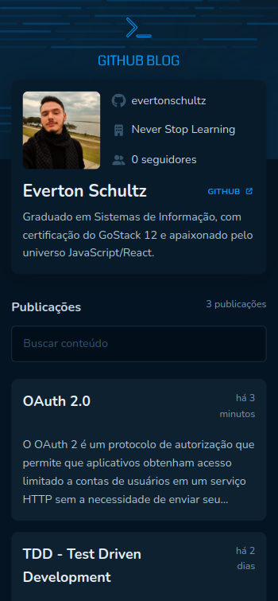
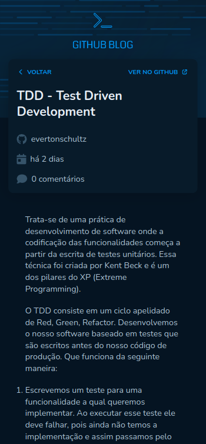
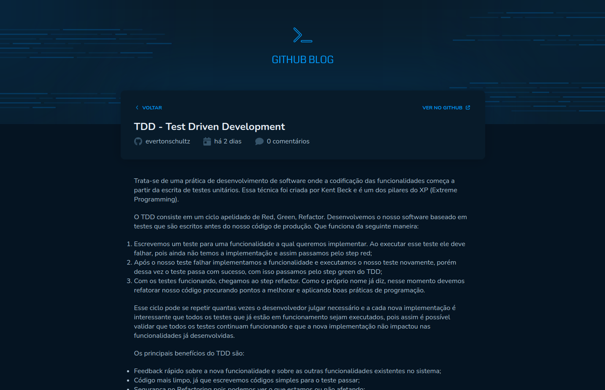
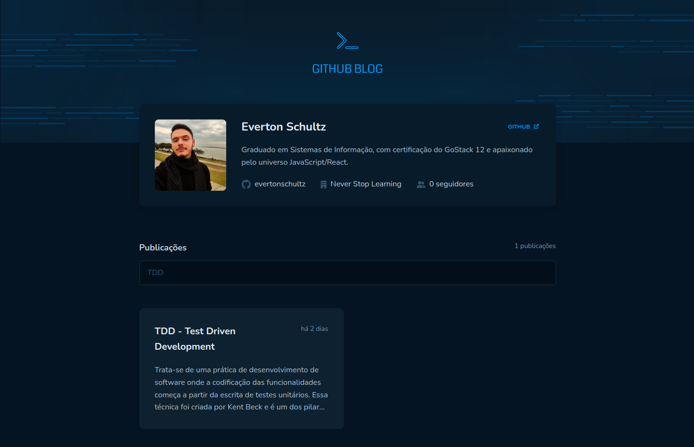

# GITHUB BLOG

## 💻 Sobre o projeto

É uma aplicação que utiliza a API do GitHub para buscar issues de um repositório, dados do seu perfil e exibir elas como um blog.

O projeto foi desenvolvido no desafio 03 da trilha atualizada de ReactJs do Ignite, disponibilizado pela Rocketseat.

---

## ⚙️ Funcionalidades

- Listagem do perfil com imagem, número de seguidores, nome e outras informações disponíveis pela API do GitHub.
- Lista e filtro de todas as issues do repositório com um pequeno resumo do conteúdo dela.
- Uma página para exibir um post (issue) completo.

Para o desenvolvimento foram aplicados conceitos como:
- Fetch / Axios
- Roteamento e React Router DOM
- Formulários

---

## 🎨 Layout

### Web responsivo (Mobile)

<p align="center">
  

  
</p>

### Web (Desktop)

<p align="center" style="display: flex; align-items: flex-start; justify-content: center;">
  

  

  
</p>

---

## 🚀 Como executar o projeto
A aplicação foi desenvolvida utilizando [VITE v3.1.7.](https://vitejs.dev/)

### Pré-requisitos
Antes de começar, você vai precisar ter instalado em sua máquina as seguintes ferramentas: [Git](https://git-scm.com), [ReactJS](https://reactjs.org/). Além disso, é bom ter um editor para trabalhar com o código como [VSCode](https://code.visualstudio.com/). Também considere utilizar a documentação do [VITE](https://vitejs.dev/) para fazer alterações no projeto.

#### Rodando a aplicação web (Frontend)
```bash

# Clone este repositório
$ git clone git@github.com:evertonschultz/03-desafio-github-blog.git

# Acesse a pasta do projeto no seu terminal/cmd
$ cd 03-desafio-github-blog

# Instale as dependências
$ npm install

# Execute a aplicação em modo de desenvolvimento
$ npm run dev

# A aplicação será aberta na porta:5173 - acesse http://localhost:5173

```

---

## 🛠 Tecnologias
As seguintes ferramentas foram usadas na construção do projeto:

#### **Website**  ([VITE](https://vitejs.dev/)  +  [React](https://reactjs.org/)  +  [TypeScript](https://www.typescriptlang.org/))

-   **[React Router Dom](https://reactrouter.com/en/main)**
-   **[Font Awesome](https://fontawesome.com/docs/web/use-with/react/)**
-   **[Axios](https://axios-http.com/ptbr/docs/intro)**
-   **[Date fns](https://date-fns.org/)**
-   **[React Hook Form](https://react-hook-form.com/)**
-   **[React Markdown](https://github.com/remarkjs/react-markdown)**
-   **[Styled Components](https://styled-components.com/)**
-   **[Zod](https://github.com/colinhacks/zod)**

---

## 🦸 Autor

 <br />
 <sub><b>Everton Schultz</b></sub></a>
 <br />

[](https://www.linkedin.com/in/https://www.linkedin.com/in/%C3%A9verton-schultz-824a1612b/)
[](mailto:evertonf.m.schultz98@gmail.com)

---

## License
Este projeto pode ser usado por qualquer pessoa! Licença MIT
